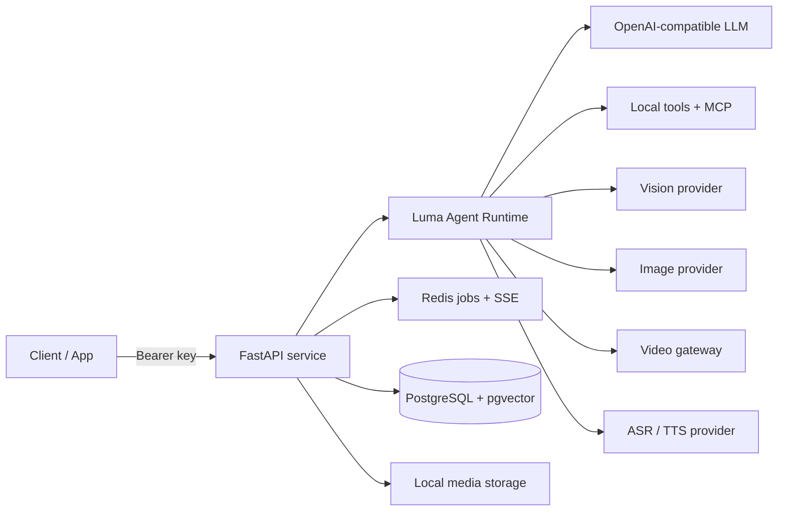

<div align="center">

# ✦ Luma

### A self-hosted AI automation service for conversations, tools, media, and production workflows.

[](#-quick-start)
[](#-architecture)
[](#-agent-runtime)
[](#-architecture)
[](#-architecture)
[](#-quick-start)

</div>

> **Luma** turns a natural-language request into an observable, tool-driven workflow. It supports ordinary chat, structured tool calling, vision-aware conversations, image creation, RAG, codebase analysis, MCP services, speech, and storyboard-guided short-video production.

## ✨ What Luma Can Do

| | Capability | What it handles |
| :--: | --- | --- |
| 🧠 | **Agent runtime** | Dynamic tool selection, multi-step execution, context-aware follow-ups, and safe final responses |
| 🔎 | **Research & MCP** | Web search, weather, remote MCP services, and business workflows exposed as tools |
| 👁️ | **Vision & images** | Image understanding, asset selection, image generation, and image editing |
| 🎬 | **Video workflow** | Concept planning, subject and scene references, multi-panel storyboards, visual review, and storyboard-guided video generation |
| 📚 | **RAG** | Document ingestion, semantic chunking, vector retrieval, focused knowledge-base answers |
| 💻 | **Coding analysis** | Upload a codebase for read-only structure, flow, risk, and implementation analysis |
| 🎙️ | **Speech** | Real-time ASR over WebSocket and TTS for final text responses |

## 🗺️ Architecture



**Durable state** lives in PostgreSQL. **Live execution**, cancellation, and server-sent events live in Redis. Media stays local under `./data/media`, so the project can run without S3 or a CDN.

## 🚀 Quick Start

### 1. Prepare configuration

```bash
git clone https://github.com/<your-account>/Luma-Agent.git
cd Luma-Agent

cp .env.example .env
cp backend/.env.example backend/.env
```

Set matching database values in both files, then add at least these settings to `backend/.env`:

```dotenv
LUMA_API_KEY=replace-with-a-long-random-service-key
LLM_BASE_URL=https://your-provider.example/v1
LLM_API_KEY=replace-with-your-provider-key
AGENT_MODEL=your-agent-model
```

### 2. Start the stack

```bash
docker compose up --build -d
curl http://localhost:8001/healthz
```

Expected response:

```json
{"status":"ok"}
```

### 3. Create a conversation

```bash
curl -X POST http://localhost:8001/v1/sessions \
  -H "Authorization: Bearer $LUMA_API_KEY" \
  -H 'Content-Type: application/json' \
  -d '{"project_id":"demo","title":"My first Luma session"}'
```

> 💡 Port `8001` already occupied? Set `LUMA_PORT` in the root `.env`. When using a reverse proxy, update `PUBLIC_API_BASE`, `PUBLIC_IMAGE_BASE_URL`, and `PUBLIC_MEDIA_BASE_URL` in `backend/.env` too.

## 🧠 Agent Runtime

Luma does not hard-code a fixed tool sequence. For every request it:

1. **Builds context** from the active conversation, relevant visual assets, project state, and optional Skill guidance.
2. **Selects candidates** with a lightweight tool selector that reads recent history, not only the last user message.
3. **Runs the agent loop** with the selected local tools and/or an MCP service domain.
4. **Feeds tool observations back** to the model until it has enough information to answer or complete the workflow.
5. **Persists outcomes** to PostgreSQL and streams live job state over Redis-backed SSE.

This keeps ordinary Q&A lightweight while allowing multi-tool work such as **research → infographic**, **storyboard → video**, or **image → vision → edit**.

## 🔌 API Surface

| Area | Endpoints |
| --- | --- |
| ❤️ Health | `GET /healthz` |
| 💬 OpenAI compatibility | `POST /v1/chat/completions`, `POST /v1/responses`, `GET /v1/models` |
| ⚡ Agent runs | `POST /v1/agent/runs`, run state, SSE events, cancellation |
| 🗂️ Sessions | Create, list, update, delete, message history, regeneration, and latest job state under `/v1/sessions` |
| 🖼️ Assets | `POST /v1/assets`, `POST /v1/images/generations`, `POST /v1/images/edits`, `GET /temp_file/{name}` |
| 📚 RAG | File upload, collections, document state, job SSE, `POST /v1/rag/search` |
| 💻 Coding | `POST /v1/coding/workspaces` |
| 🎙️ Audio | `WS /v1/audio/asr`, `POST /v1/audio/tts` |
| 🎬 Video | `GET /v1/sessions/{id}/video-generation` |

All endpoints except `/healthz` use:

```http
Authorization: Bearer <LUMA_API_KEY>
X-Luma-Project-ID: my-project
```

`X-Luma-Project-ID` is optional and defaults to `default`. It isolates sessions, RAG collections, assets, code workspaces, and video projects inside one deployment.

## 🧩 Configure Only What You Need

Luma's integrations are independent. The chat provider is enough for a basic agent; add other keys only when you enable their capability.

| Integration | Primary settings |
| --- | --- |
| 💬 Chat Agent | `LLM_BASE_URL`, `LLM_API_KEY`, `AGENT_MODEL` |
| 👁️ Vision | `VISION_LLM_BASE_URL`, `VISION_LLM_API_KEY`, `VISION_LLM_MODEL` |
| 🎨 Images | `IMAGE_PROVIDER`, `IMAGE_BASE_URL`, `IMAGE_API_KEY`, `IMAGE_MODEL` |
| 📚 RAG | Embedding and document-processing provider settings |
| 🎙️ Speech | `DASHSCOPE_API_KEY` |
| 🔎 Search / Weather | Corresponding provider key and endpoint |
| 🔌 MCP | MCP server configuration |
| 🎬 Video | `VIDEO_GATEWAY_BASE_URL`, `VIDEO_GATEWAY_API_KEY` |

### Image providers

- **OpenAI-compatible**: set `IMAGE_PROVIDER=openai_images` and point `IMAGE_BASE_URL` to a compatible image endpoint.
- **Qwen Image**: set `IMAGE_PROVIDER=qwen_image` with a Qwen compatible-mode endpoint and model.

## 📡 Agent Run Example

```bash
curl -X POST http://localhost:8001/v1/agent/runs \
  -H "Authorization: Bearer $LUMA_API_KEY" \
  -H 'Content-Type: application/json' \
  -d '{
    "project_id": "demo",
    "session_id": "sess_replace_me",
    "model": "your-agent-model",
    "messages": [
      {"role":"user","content":"Search this week’s AI news and create an infographic."}
    ]
  }'
```

The request returns a `job_id`. Subscribe to `/v1/agent/runs/{job_id}/events` for live progress instead of polling repeatedly.

## 🛡️ Deployment Notes

- 🔐 Never commit `.env`, local media, coding workspaces, or database dumps.
- 🧱 PostgreSQL and Redis remain private to the Compose network by default.
- 🌐 Put TLS and cache headers in a reverse proxy before exposing the API publicly.
- 💾 Mount `./data` on durable local storage before long-running RAG or media workloads.
- 🧪 `docker compose logs -f api` shows Agent, RAG, and video reconciliation activity.

---

<div align="center">
  Built for teams that want an agent runtime they can inspect, extend, and run themselves. ✦
</div>

