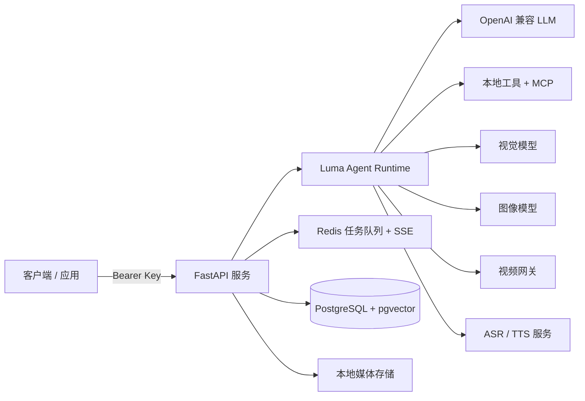

<div align="center">

[English](README.md) | **简体中文**

# ✦ Luma

### 面向对话、工具、媒体与内容生产工作流的自托管 AI 自动化服务。

[](#-快速开始)
[](#️-系统架构)
[](#-agent-运行机制)
[](#️-系统架构)
[](#️-系统架构)
[](#-快速开始)

</div>

> **Luma** 将自然语言请求变成可观测、可追踪的工具工作流。它支持普通对话、结构化工具调用、看图理解、图片创作、RAG、代码库分析、MCP 服务、语音，以及由分镜图驱动的短视频制作。

## ✨ Luma 能做什么

| | 能力 | 用途 |
| :--: | --- | --- |
| 🧠 | **Agent 运行时** | 动态筛选工具、多步执行、结合上下文的连续对话与可靠收尾 |
| 🔎 | **检索与 MCP** | 网页搜索、天气、远程 MCP 服务，以及被封装为工具的业务工作流 |
| 👁️ | **视觉与图片** | 图片理解、资产选择、生图、修图与图片质量审查 |
| 🎬 | **视频工作流** | 概念规划、角色/场景素材、多格分镜图、视觉质检与分镜图引导的视频生成 |
| 📚 | **RAG** | 文档导入、语义切块、向量检索与聚焦的知识库问答 |
| 💻 | **代码分析** | 上传项目后进行只读的结构、链路、风险和工程实现分析 |
| 🎙️ | **语音** | WebSocket 实时 ASR 与助手最终回复的 TTS |

## 🗺️ 系统架构



**长期数据**保存在 PostgreSQL；**运行中的任务、取消信号和事件流**由 Redis 承担。媒体文件默认放在 `./data/media`，不依赖 S3 或 CDN 也能运行。

## 🚀 快速开始

### 1. 准备配置

```bash
git clone https://github.com/<your-account>/Luma-Agent.git
cd Luma-Agent

cp .env.example .env
cp backend/.env.example backend/.env
```

根目录与 `backend/.env` 中的数据库配置需要保持一致。随后至少在 `backend/.env` 配置：

```dotenv
LUMA_API_KEY=replace-with-a-long-random-service-key
LLM_BASE_URL=https://your-provider.example/v1
LLM_API_KEY=replace-with-your-provider-key
AGENT_MODEL=your-agent-model
```

### 2. 启动服务

```bash
docker compose up --build -d
curl http://localhost:8001/healthz
```

预期返回：

```json
{"status":"ok"}
```

### 3. 创建会话

```bash
curl -X POST http://localhost:8001/v1/sessions \
  -H "Authorization: Bearer $LUMA_API_KEY" \
  -H 'Content-Type: application/json' \
  -d '{"project_id":"demo","title":"我的第一个 Luma 会话"}'
```

> 💡 若 `8001` 端口被占用，在根目录 `.env` 中修改 `LUMA_PORT`。部署到反向代理后，也应同步调整 `backend/.env` 内的 `PUBLIC_API_BASE`、`PUBLIC_IMAGE_BASE_URL` 与 `PUBLIC_MEDIA_BASE_URL`。

## 🧠 Agent 运行机制

Luma 不会把工具调用写死成固定流程。每次请求都会经过以下阶段：

1. **构建上下文**：汇集当前对话、关联视觉资产、项目状态和可选的 Skill 指引。
2. **筛选候选能力**：轻量工具选择器读取近期历史，而非只看最后一句话。
3. **执行 Agent 循环**：主模型获得筛选后的本地工具或 MCP 服务域，决定执行顺序和参数。
4. **回看工具观察结果**：模型根据真实返回决定是否继续调用工具，直到信息充分或任务完成。
5. **保存与推送状态**：结果写入 PostgreSQL，实时状态通过 Redis 驱动的 SSE 推送。

因此，普通问答保持轻量，而“**查新闻 → 生成版图**”“**分镜图 → 视频**”“**图片 → 识图 → 修图**”这类多工具任务也可以自然完成。

## 🔌 API 一览

| 模块 | 接口 |
| --- | --- |
| ❤️ 健康检查 | `GET /healthz` |
| 💬 OpenAI 兼容层 | `POST /v1/chat/completions`、`POST /v1/responses`、`GET /v1/models` |
| ⚡ Agent 任务 | `POST /v1/agent/runs`、任务状态、SSE 事件流、取消 |
| 🗂️ 会话 | `/v1/sessions` 下的创建、列表、修改、删除、历史、重试和最新任务 |
| 🖼️ 图片与文件 | `POST /v1/assets`、`POST /v1/images/generations`、`POST /v1/images/edits`、`GET /temp_file/{name}` |
| 📚 RAG | 文件上传、知识库/文档读取、导入任务与 SSE、`POST /v1/rag/search` |
| 💻 代码分析 | `POST /v1/coding/workspaces` |
| 🎙️ 语音 | `WS /v1/audio/asr`、`POST /v1/audio/tts` |
| 🎬 视频 | `GET /v1/sessions/{id}/video-generation` |

除 `/healthz` 外，接口都需要服务密钥：

```http
Authorization: Bearer <LUMA_API_KEY>
X-Luma-Project-ID: my-project
```

`X-Luma-Project-ID` 可选，默认值为 `default`。它可在同一个部署内隔离会话、知识库、媒体资产、代码工作区和视频项目。

## 🧩 按需配置能力

Luma 的各项集成是独立的。基础对话只需配置聊天模型；其他能力需要时再填对应 Key 即可。

| 集成 | 主要配置 |
| --- | --- |
| 💬 Chat Agent | `LLM_BASE_URL`、`LLM_API_KEY`、`AGENT_MODEL` |
| 👁️ Vision | `VISION_LLM_BASE_URL`、`VISION_LLM_API_KEY`、`VISION_LLM_MODEL` |
| 🎨 图像 | `IMAGE_PROVIDER`、`IMAGE_BASE_URL`、`IMAGE_API_KEY`、`IMAGE_MODEL` |
| 📚 RAG | Embedding 与文档处理模型配置 |
| 🎙️ 语音 | `DASHSCOPE_API_KEY` |
| 🔎 搜索 / 天气 | 对应服务的 Key 与 Endpoint |
| 🔌 MCP | MCP 服务配置 |
| 🎬 视频 | `VIDEO_GATEWAY_BASE_URL`、`VIDEO_GATEWAY_API_KEY` |

### 图片服务

- **OpenAI 兼容生图服务**：设置 `IMAGE_PROVIDER=openai_images`，并将 `IMAGE_BASE_URL` 指向兼容的图像 API。
- **Qwen Image**：设置 `IMAGE_PROVIDER=qwen_image`，配置千问 compatible-mode Endpoint 与模型即可。

## 📡 发起一次 Agent 任务

```bash
curl -X POST http://localhost:8001/v1/agent/runs \
  -H "Authorization: Bearer $LUMA_API_KEY" \
  -H 'Content-Type: application/json' \
  -d '{
    "project_id": "demo",
    "session_id": "sess_replace_me",
    "model": "your-agent-model",
    "messages": [
      {"role":"user","content":"帮我汇总本周 AI 新闻，并生成一张信息版图。"}
    ]
  }'
```

接口会返回 `job_id`。推荐订阅 `/v1/agent/runs/{job_id}/events` 获取实时状态，而不是持续轮询。

## 🛡️ 部署说明

- 🔐 不要提交 `.env`、本地媒体文件、代码工作区和数据库导出文件。
- 🧱 PostgreSQL 与 Redis 默认只在 Docker Compose 内网中可见。
- 🌐 对外部署时，建议在 API 前加启用 TLS 的反向代理并配置缓存头。
- 💾 长期运行 RAG 或媒体任务前，请将 `./data` 挂载到持久化本地存储。
- 🧪 使用 `docker compose logs -f api` 查看 Agent、RAG 与视频任务的运行日志。

---

<div align="center">
  为希望自行检查、扩展并运行 Agent Runtime 的团队而构建。✦
</div>

